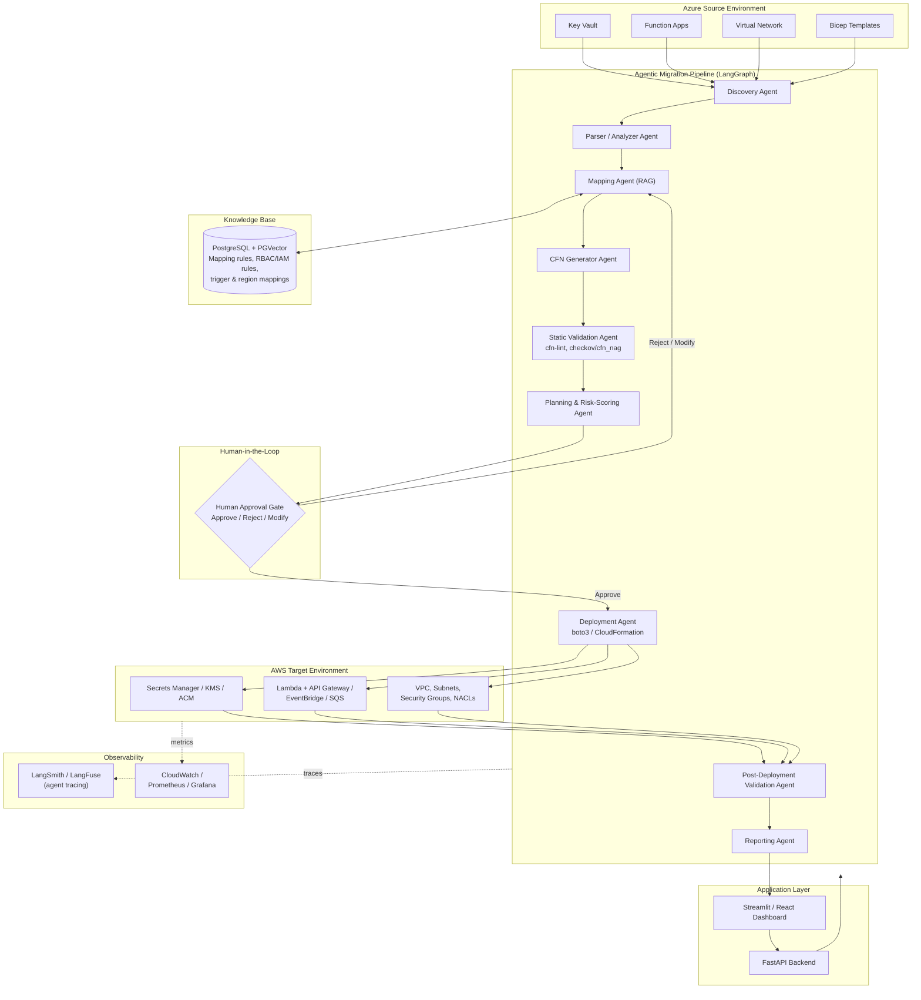

# High-Level Architecture — Agentic Azure→AWS Migration Assistant

This diagram shows the end-to-end flow: Azure source discovery, the LangGraph multi-agent pipeline, the RAG knowledge base, the human approval gate, AWS deployment, and the supporting application/observability layer.

## Component Summary

| Layer | Components | Role |
|---|---|---|
| **Azure Source** | Key Vault, Function Apps, VNet, Bicep templates | The environment being migrated |
| **Agent Pipeline** | Discovery → Parser/Analyzer → Mapping → CFN Generator → Static Validation → Planning/Risk-Scoring → Deployment → Post-Deploy Validation → Reporting | LangGraph-orchestrated agents that carry out discovery, translation, validation, and verification |
| **Knowledge Base** | PostgreSQL + PGVector (RAG store) | Grounds the Mapping Agent in real Bicep→CFN, RBAC→IAM, and trigger-mapping rules instead of free-form LLM guessing |
| **Human-in-the-Loop** | Approval Gate | Mandatory checkpoint before any AWS deployment — Approve / Reject / Modify |
| **AWS Target** | Secrets Manager/KMS/ACM, Lambda+API Gateway/EventBridge/SQS, VPC/Subnets/SGs/NACLs | The deployed, functionally-equivalent AWS environment |
| **Application Layer** | FastAPI backend, Streamlit/React dashboard | Exposes pipeline status, migration plans, and reports to users |
| **Observability** | LangSmith/LangFuse, CloudWatch/Prometheus/Grafana | Agent tracing and infrastructure/runtime monitoring |
