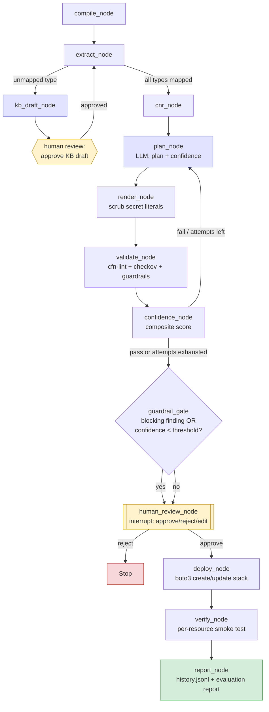

# Plan: Agentic Azure→AWS IaC Migration Capstone (LangGraph)

## Use case / differentiation (for write-up)
Existing tools (Former2, cf-terraform, Azure Migrate) either reverse-engineer FROM a live
cloud account or move workloads WITHIN one cloud. None do source-code-level cross-cloud
IaC translation (Bicep→CFN) with self-correcting generation, per-resource confidence
scoring, security guardrails, and gated autonomous deployment. Differentiators to write up:
1. Deterministic-plan / non-deterministic-reasoning split (LLM never emits template syntax
   directly — mirrors existing pilot's MigrationPlan JSON approach) → auditable, replayable.
2. Composite confidence score per resource, not just a pass/fail lint result.
3. Guardrail gate + human-in-the-loop approval before any real AWS mutation.
4. Self-extending knowledge base seeded from one human-authored doc (Key Vault), agent
   drafts new docs for VPC/Functions, human reviews before they become "trusted".
5. Secrets never hit disk/logs in plaintext — masked wrapper + redaction filter.

## Confirmed decisions (user, 2026-09-23)
- Scope: exactly 3 resources — Key Vault, VPC, Functions (Azure Functions → AWS Lambda).
- Fresh redesign of control flow as a multi-agent LangGraph graph — but REUSE the existing
  deterministic building blocks in orchestrator/ (bicep_compiler, resource_extractor,
  knowledge_base, cloud_neutral, migration_plan, cfn_generator, validator) as tool
  functions/nodes rather than rewriting them from scratch.
- Orchestration framework: LangGraph.
- Deployment: agent runs actual `aws cloudformation deploy`/boto3, but only after a human
  approval gate (interrupt) — not fully autonomous.
- Confidence score = composite of (a) LLM self-reported confidence per resource,
  (b) validator pass/fail (cfn-lint + guardrail scan), (c) historical success rate for that
  resource type from a local run-history log.
- Deliverable framing: academic/portfolio capstone — needs strong evaluation section
  (metrics, calibration, differentiation narrative), not just working code.
- Secrets: agent MAY transport actual secret values end-to-end, but must mask them in all
  logs/state dumps and never write plaintext to disk; only human-approved deploy step
  unwraps the real value at the AWS API boundary.
- Manual markdown doc precedent exists only for Key Vault
  (bicep-to-cloudformation.md) — VPC and Functions docs are agent-drafted, human-reviewed
  before being trusted as knowledge-base entries (this asymmetry is itself a capstone
  talking point: "seed-and-generalize" KB growth).

## Architecture — LangGraph state graph

**State (MigrationState, single dataclass/TypedDict)**: bicep_path, arm_json, resource_types,
kb_coverage, cnr, migration_plan, per_resource_confidence{}, cfn_yaml, lint_findings,
guardrail_findings, overall_confidence, human_decision, deploy_result, verification_result,
run_id, redacted_secret_refs{} (real values held in a separate in-memory-only
`SecretVault` object keyed by ref, never serialized into state/log).

**Nodes** (each a function wired into the graph; solid arrows = normal path, dashed = retry):
1. `compile_node` — wraps `bicep_compiler.py` (existing, deterministic).
2. `extract_node` — wraps `resource_extractor.py` + `knowledge_base.py`; on unmapped type,
   routes to `kb_draft_node` instead of failing hard (new behavior vs today's hard exit).
3. `kb_draft_node` (new) — LLM drafts a candidate mapping doc for an unmapped resource type
   using the Key Vault doc as a few-shot template; writes to
   `knowledge_base/drafts/<type>.md`; routes to a human-review interrupt before promoting
   the draft into `knowledge_base/index.json`.
4. `cnr_node` — wraps `cloud_neutral.build_cnr()` (existing, deterministic).
5. `plan_node` — wraps `generator.py` + `migration_plan.py`; prompt additionally requires the
   LLM to emit a `confidence` (0–1) and short rationale per planned resource.
6. `render_node` — wraps `cfn_generator.generate_cloudformation()` (existing, deterministic,
   no LLM) + new `_scrub_secret_literals()` guard that hard-fails if a real secret value
   leaked into rendered YAML instead of a `!Ref`/`NoEcho` parameter.
7. `validate_node` (extended) — existing `cfn-lint` call + NEW `checkov`/`cfn_nag` security
   scan + custom guardrail checks (see Guardrails below). Produces `lint_findings` +
   `guardrail_findings`.
8. `confidence_node` (new, `orchestrator/confidence.py`) — computes composite
   `overall_confidence` per resource from plan-node self-score + validate_node pass/fail +
   historical success rate pulled from `output/runs/history.jsonl`.
9. **Retry edge**: if validate_node fails and attempts < `max_fix_attempts`, loop back to
   `plan_node` with the failure feedback appended (same self-correction pattern as today).
10. `guardrail_gate` (new) — if any guardrail is hard-blocking OR `overall_confidence` <
    threshold (default 0.7, configurable), force `human_review_node`; otherwise still route
    through it if `--auto` not passed (default: always require approval per user decision).
11. `human_review_node` (LangGraph `interrupt()`) — renders a CLI table (rich): per-resource
    confidence, validator/guardrail status, diff of generated YAML, estimated AWS resources
    to be created. Human answers approve / reject / edit-and-retry.
12. `deploy_node` (new, `orchestrator/deploy.py`) — boto3 `cloudformation.create_stack`/
    `update_stack` (not `deploy` CLI subprocess, to avoid secret values touching argv/shell
    history); pulls real values from `SecretVault` only at this boundary; masked in any
    logging via a logging filter (`orchestrator/secrets_handling.py`).
13. `verify_node` (new, `orchestrator/verify.py`) — post-deploy smoke tests per resource type:
    Key Vault → `describe-secret`/`get-secret-value` existence check (value itself never
    logged); VPC → `describe-vpcs`/`describe-subnets` reachability check; Functions →
    `lambda invoke` with a no-op test payload, check `StatusCode`.
14. `report_node` (new, `orchestrator/evaluation.py`) — appends run outcome to
    `output/runs/history.jsonl` (used by confidence_node next run) and writes a
    human-readable evaluation report (used for the capstone metrics section).

**Graph shape**: linear spine (1→2→4→5→6→7→8) with two loop-back edges
(7/8 → 5 for self-correction; 3 → human review → 2 for KB draft approval), then a gate
(10) before the "real world" tail (11→12→13→14).

## Guardrails (`orchestrator/guardrails.py`, new)
- Static: cfn-lint (existing), checkov or cfn_nag security scan (new dependency).
- Custom AST/regex checks on rendered YAML:
  - No literal secret values outside `NoEcho` parameters / `!Ref`.
  - No IAM policy statement with `Action: "*"` or `Resource: "*"` for Functions execution
    role.
  - No security group / NACL rule with `0.0.0.0/0` on a non-HTTP(S) port for VPC.
  - No `DeletionPolicy` missing on stateful resources (Secrets, potentially S3 for Lambda
    artifacts) — warn if not `Retain`/`Snapshot` where relevant.
- Guardrail severities: `block` (forces human_review + surfaced prominently) vs `warn`
  (shown but doesn't force gate if confidence already high).

## Confidence scoring (`orchestrator/confidence.py`, new)
`overall = w1*llm_self_score + w2*validator_pass(0/1) + w3*historical_success_rate`
(default weights 0.4/0.4/0.2, configurable via env, documented rationale in code comment).
Per-run calibration logged to `history.jsonl`: {resource_type, predicted_confidence,
actual_outcome (deploy success/fail), timestamp} — used later to compute a Brier score for
the evaluation report (capstone metric: "is our confidence well-calibrated?").

## Secrets handling (`orchestrator/secrets_handling.py`, new)
- `SecretValue` wrapper class: `__repr__`/`__str__` return `"***"`; `.reveal()` explicit
  method only called inside `deploy_node`.
- Logging filter installed on the root logger that redacts any string matching known
  secret refs before it reaches a handler (belt-and-suspenders in addition to the wrapper).
- Values sourced via `getpass`/env var at runtime, never via CLI flags (avoids shell
  history / process list exposure) — deploy uses boto3 parameter dict, not
  `aws cloudformation deploy --parameter-overrides` subprocess string.

## New source content required (parallel with graph build)
- `resources/vpc/main.bicep` (Microsoft.Network/virtualNetworks + subnets + NSG) — target
  AWS::EC2::VPC + Subnets + SecurityGroup.
- `resources/functions/main.bicep` (Microsoft.Web/sites kind=functionapp + serverfarms +
  storage account) — target AWS::Lambda::Function + IAM::Role + (+API Gateway if HTTP
  trigger) + S3 bucket for deployment package.
- `knowledge_base/vpc-to-cloudformation.md`, `knowledge_base/functions-to-cloudformation.md`
  — agent-drafted (via kb_draft_node), human-reviewed, following the existing Key Vault doc
  structure (concept diff table, resource/param/property mapping, commands, gotchas).
- Update `knowledge_base/index.json` with the two new ARM type → doc mappings once approved.

## Tech stack
- Orchestration: LangGraph (Python) — StateGraph + `interrupt()` for human-in-the-loop.
- LLM: keep AWS Bedrock via existing `Generator` ABC (`orchestrator/generator.py`), reused
  as a LangGraph node/tool call, not replaced.
- Guardrail scanning: `checkov` (or `cfn_nag`) added to requirements.txt alongside existing
  `cfn-lint`.
- Deploy/verify: `boto3` (cloudformation, secretsmanager, ec2, lambda clients) — already a
  dependency.
- CLI review UX: `rich` (new dependency) for the human-review table/diff.
- Persistence: flat files — `output/runs/<run_id>/` per-run artifacts + evaluation report,
  `output/runs/history.jsonl` for calibration/confidence history. No DB needed at this scale.
- Testing: `pytest` for deterministic nodes/guardrails/confidence math; recorded-response
  fixtures for the LLM plan node to test the self-correction loop without live Bedrock calls.

## Phases / steps
**Phase A — Content (parallel with Phase B)**
1. Author `resources/vpc/main.bicep` and `resources/functions/main.bicep`.
2. Run `kb_draft_node` flow (or manually bootstrap) to produce the two new KB docs; human
   review; update `index.json`.

**Phase B — Graph core** (*depends on nothing from Phase A to start scaffolding*)
3. Build `orchestrator/graph.py`: MigrationState + node wrappers around existing
   bicep_compiler/resource_extractor/knowledge_base/cloud_neutral/migration_plan/
   cfn_generator/validator modules (thin adapters, no logic rewrite).
4. Add `kb_draft_node` + human-review interrupt for new resource types (*depends on 3*).
5. Extend `migration_plan.py` schema + `PLAN_JSON_SCHEMA_HINT` to require per-resource
   confidence + rationale (*depends on 3*).

**Phase C — Guardrails & Confidence** (*depends on Phase B step 3*)
6. `orchestrator/guardrails.py` — checkov integration + custom checks; wire into
   `validate_node`.
7. `orchestrator/confidence.py` — composite scoring + `history.jsonl` read/write.
8. `guardrail_gate` node wiring confidence + guardrail severity → forced human review.

**Phase D — Secrets & Deploy** (*depends on Phase C*)
9. `orchestrator/secrets_handling.py` — SecretValue wrapper + logging redaction filter.
10. `orchestrator/deploy.py` — boto3-based create/update stack, human-approval gated.
11. `orchestrator/verify.py` — per-resource-type post-deploy smoke tests.

**Phase E — Evaluation & Docs** (*depends on D; can start report scaffolding earlier*)
12. `orchestrator/evaluation.py` — run-history logging + report generation (pass rate,
    calibration/Brier score, human-intervention rate, time-to-migrate).
13. Run N end-to-end migrations across the 3 resource types to populate real evaluation
    data.
14. Update README.md (new architecture, new resources) + write the differentiation/use-case
    section using the framing above; keep bicep-to-cloudformation.md as the single manual
    reference doc as originally planned.

## Verification
1. `pytest` covering: guardrail custom checks (unit), confidence composite formula (unit),
   cfn_generator secret-literal scrub (unit), migration_plan schema validation w/ confidence
   field (unit).
2. Dry-run style check (no LLM/AWS calls) for all 3 resource types: compile→extract→CNR
   only, confirming KB coverage after Phase A.
3. Full graph run (LLM + guardrails, no deploy) for each resource type; confirm
   `overall_confidence` populated and guardrail_gate triggers human_review as expected on a
   deliberately bad plan fixture (e.g. inject an IAM `*` action) to prove the gate works.
4. One real gated deploy + verify + rollback (`delete-stack`) cycle per resource type in a
   sandbox AWS account, with explicit user confirmation before running (deploy is a
   shared/costly action).
5. Evaluation report reviewed for calibration sanity (predicted confidence vs actual
   outcome across the sample runs).

## Further considerations
1. Repo/folder is still named `az_key_vault` though scope now spans 3 services — cosmetic,
   left as-is unless you want it renamed (rename is a manual/destructive-ish action, would
   ask separately before doing).
2. Functions HTTP-trigger → API Gateway mapping adds meaningful scope (auth, CORS, stages).
   Recommend starting with a simple timer/queue-triggered function (Lambda-only, no API
   Gateway) for the MVP resource, and treating HTTP-trigger+API-Gateway as a stretch goal.
3. `checkov` vs `cfn_nag`: recommend `checkov` (pure Python, easier install on Windows,
   already ecosystem-aligned with pyyaml/boto3 stack) unless you have a reason to prefer
   `cfn_nag` (Ruby-based).
