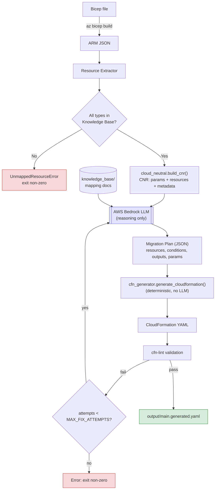

# Azure Bicep to AWS CloudFormation Migration Tool

A Python-based migration orchestrator that converts Azure Bicep templates to AWS CloudFormation templates using LLM reasoning and deterministic code generation.

## Overview
https://chatgpt.com/share/6ab25be7-ea88-83ee-971a-663947b04adb

This project is a pilot for migrating Azure infrastructure-as-code (Bicep) workloads to AWS CloudFormation. It combines:

- **Bicep Compilation**: Converts Bicep templates to ARM JSON via the Azure CLI
- **Resource Extraction**: Identifies all resources and validates they have migration knowledge
- **LLM Reasoning**: Uses AWS Bedrock to generate migration plans (structured JSON)
- **Deterministic Generation**: Converts plans to valid CloudFormation YAML with no further LLM involvement
- **Validation & Self-Correction**: Runs cfn-lint and automatically retries with corrected plans on errors

## Key Features

✅ **Dry-run mode** (`--dry-run`) — validates template structure and resource coverage without LLM calls  
✅ **Intelligent error recovery** — self-correction loop feeds cfn-lint failures back to the LLM  
✅ **Knowledge base system** — markdown docs map resource types to AWS equivalents; easily extensible  
✅ **Pluggable LLM backend** — abstractions in place to swap AWS Bedrock for other generators  
✅ **CLI interface** — `python migrate.py <bicep-file> [options]`

## Prerequisites

### System Requirements
- **Python 3.8+**
- **Azure CLI 2.90.0+** (with `az bicep build` support)
- **AWS Bedrock access** (optional; required for full migration, not needed for `--dry-run`)

### AWS Configuration (for full runs)
- AWS CLI v2 installed
- AWS credentials configured (`~/.aws/credentials` or environment variables)
- IAM permissions: `bedrock:InvokeModel` with the configured model

## Project Structure

```
.
├── README.md                          # This file
├── migrate.py                         # CLI entrypoint
├── requirements.txt                   # Python dependencies
├── main.bicep                         # Example Azure Bicep template
├── main.json                          # Compiled ARM JSON (generated by `az bicep build`)
├── main.generated.yaml                # Generated CloudFormation YAML (output)
├── bicep-to-cloudformation.md         # Resource mapping documentation (Key Vault example)
├── knowledge_base/
│   └── index.json                     # Index mapping ARM resource types to docs
└── orchestrator/
    ├── __init__.py
    ├── bicep_compiler.py              # Bicep → ARM JSON compilation
    ├── resource_extractor.py           # Extract resource types from ARM
    ├── knowledge_base.py               # Load and query knowledge base
    ├── cloud_neutral.py                # Cloud-neutral representation (CNR) builder
    ├── migration_plan.py               # Migration plan structures & parsing
    ├── generator.py                    # LLM interface (Generator ABC, BedrockGenerator)
    ├── cfn_generator.py                # JSON plan → CloudFormation YAML
    ├── validator.py                    # cfn-lint integration
    ├── config.py                       # Configuration (env vars, defaults)
    ├── pipeline.py                     # Main migration pipeline & retry loop
    └── migration_plan.py               # Migration plan dataclasses
```

## Installation

1. **Clone or navigate to the project directory:**
   ```bash
   cd c:\Charan_workspace\azure_workspace\az_key_vault
   ```

2. **Create and activate a Python virtual environment:**
   ```bash
   python -m venv .venv
   .venv\Scripts\activate  # Windows
   # OR: source .venv/bin/activate  (macOS/Linux)
   ```

3. **Install dependencies:**
   ```bash
   pip install -r requirements.txt
   ```

4. **Verify Azure CLI is installed:**
   ```bash
   az version
   az bicep version  # Should show version info
   ```

5. **(Optional) Configure AWS credentials** for full runs:
   ```bash
   aws configure
   # OR set environment variables:
   #   AWS_ACCESS_KEY_ID=...
   #   AWS_SECRET_ACCESS_KEY=...
   #   AWS_REGION=us-east-1 (default)
   ```

## Usage

### Dry-Run Mode (No LLM Calls)

Validates template structure, resource extraction, and knowledge base coverage without making Bedrock API calls:

```bash
python migrate.py main.bicep --dry-run
```

**Output:**
```
✓ Compiled: main.bicep → ARM JSON (main.json)
✓ Extracted 2 resource types
✓ All resource types mapped in knowledge base
✓ Dry-run: skipping LLM generation
```

### Full Migration Run

Performs the complete pipeline with LLM reasoning:

```bash
python migrate.py main.bicep
```

**Steps:**
1. Compile Bicep to ARM JSON
2. Extract resources and validate coverage
3. Build cloud-neutral representation (CNR)
4. Call LLM to generate migration plan (JSON)
5. Parse and validate the plan
6. Render plan → CloudFormation YAML
7. Run cfn-lint validation
8. If errors: retry with corrected plan (up to `MAX_FIX_ATTEMPTS` times)
9. Write validated output to `output/main.generated.yaml`

### CLI Options

```bash
python migrate.py <bicep-file> [OPTIONS]

Options:
  --dry-run              Run only compilation and KB validation; skip LLM
  --output-dir DIR       Output directory for generated YAML (default: output/)
  --kb-index PATH        Path to knowledge base index (default: knowledge_base/index.json)
  -h, --help             Show this help message
```

### Environment Variables

```bash
# AWS Bedrock configuration
BEDROCK_MODEL_ID=anthropic.claude-3-5-sonnet-20241022-v2:0  # Default model
AWS_REGION=us-east-1                                       # Default region

# Pipeline configuration
MAX_FIX_ATTEMPTS=2                                          # Retry limit on errors
```

## How It Works

### Pipeline Architecture

The migration follows a four-stage architecture, with LLM reasoning kept strictly
separate from CloudFormation syntax generation:



- **Deterministic** stages (compile, extract, CNR build, YAML render, lint): steps B, C, E,
  H, I, J.
- **Non-deterministic** stage (LLM reasoning): step F — it only ever emits structured JSON
  (the Migration Plan), never CloudFormation syntax directly.

### Self-Correction Loop

If cfn-lint or plan validation fails:

1. Capture error details
2. Send corrected-plan request back to LLM with error context
3. Parse new plan
4. Re-render and re-validate
5. Repeat up to `MAX_FIX_ATTEMPTS` (default: 2)

This loop ensures the pipeline converges to a valid CloudFormation template.

## Knowledge Base

The knowledge base maps Azure resource types to AWS equivalents and migration strategy documents.

### Structure

**`knowledge_base/index.json`**
```json
{
  "Microsoft.KeyVault/vaults": "../bicep-to-cloudformation.md",
  "Microsoft.KeyVault/vaults/secrets": "../bicep-to-cloudformation.md"
}
```

Each entry maps an ARM resource `type` string to a markdown file that documents:
- Conceptual differences between the services
- Resource mapping (which AWS service to use)
- Parameter mapping
- Property mapping
- Deployment examples

### Example: Key Vault → Secrets Manager

See [bicep-to-cloudformation.md](bicep-to-cloudformation.md) for a complete example.

**Key points:**
- Azure Key Vault is a container; AWS Secrets Manager has standalone secrets
- Each secret becomes a separate `AWS::SecretsManager::Secret` resource
- The vault name becomes a naming prefix (e.g., `myapp/prod/db-username`)

### Adding New Resource Types

1. Research the Azure resource and its AWS equivalent
2. Create a new markdown file in `knowledge_base/` (e.g., `storage-to-s3.md`)
3. Document the mapping as shown in [bicep-to-cloudformation.md](bicep-to-cloudformation.md)
4. Add an entry to `knowledge_base/index.json`

If a resource type is unmapped, the pipeline will raise `UnmappedResourceError` and exit with code 1.

## Architecture Details

### Core Modules

#### `migrate.py`
- CLI entrypoint
- Parses command-line arguments
- Calls `pipeline.run_pipeline()`
- Handles errors and outputs results

#### `orchestrator/bicep_compiler.py`
- Calls `az bicep build --file <path> --stdout`
- Parses ARM JSON output
- Returns compiled template as a Python dict

#### `orchestrator/resource_extractor.py`
- Walks ARM `resources[]` (including nested child resources)
- Collects distinct resource `type` strings
- Used to validate knowledge base coverage

#### `orchestrator/knowledge_base.py`
- Loads `knowledge_base/index.json`
- Provides `missing_types()` to identify unmapped resources
- Provides `load_docs()` to retrieve mapping documentation

#### `orchestrator/cloud_neutral.py`
- Defines language-agnostic data structures (CNRParameter, CNRResource, CNR)
- Builds a CNR from ARM JSON
- Enables reasoning about resources independent of syntax

#### `orchestrator/migration_plan.py`
- Defines `MigrationPlan` dataclass (resources, conditions, parameters, outputs)
- Provides `PLAN_JSON_SCHEMA_HINT` for LLM prompt formatting
- Parses LLM-generated plan JSON
- Validates that all referenced conditions are declared
- Raises `MigrationPlanError` on validation failures

#### `orchestrator/generator.py`
- Abstract `Generator` class (pluggable LLM interface)
- `BedrockGenerator` implementation (calls AWS Bedrock)
- Builds prompts combining Bicep source, ARM JSON, CNR, and KB docs
- Returns `MigrationPlan` JSON from LLM

#### `orchestrator/cfn_generator.py`
- Deterministic function: `generate_cloudformation(plan: MigrationPlan) → str (YAML)`
- No LLM involved
- Handles CloudFormation intrinsics (Fn::Sub, Fn::If, etc.)
- Simplifies unnecessary intrinsics (e.g., `Fn::Sub` with no variables)

#### `orchestrator/validator.py`
- Shells out to `cfn-lint.exe` (from venv)
- Returns validation errors and warnings
- Used by self-correction loop

#### `orchestrator/pipeline.py`
- Main orchestrator: `run_pipeline(bicep_file: str, ...) → PipelineResult`
- Calls each stage in order
- Implements self-correction retry loop
- Returns structured result with output file path and validation status

## Example Workflow

### Input: `main.bicep`
```bicep
param keyVaultName string
param location string = 'eastus'
@secure()
param dbUsername string
@secure()
param dbPassword string

resource keyVault 'Microsoft.KeyVault/vaults@2023-07-01' = {
  name: keyVaultName
  location: location
  properties: {
    tenantId: subscription().tenantId
    sku: { name: 'standard' family: 'A' }
    enableRbacAuthorization: true
  }
}

resource dbUserSecret 'Microsoft.KeyVault/vaults/secrets@2023-07-01' = {
  parent: keyVault
  name: 'db-username'
  properties: { value: dbUsername }
}

resource dbPassSecret 'Microsoft.KeyVault/vaults/secrets@2023-07-01' = {
  parent: keyVault
  name: 'db-password'
  properties: { value: dbPassword }
}
```

### Command
```bash
python migrate.py main.bicep --output-dir output/
```

### Output: `output/main.generated.yaml`
```yaml
AWSTemplateFormatVersion: '2010-09-09'
Description: CloudFormation template migrated from Azure Bicep

Parameters:
  SecretNamePrefix:
    Type: String
    Description: Prefix for secret names (e.g., myapp/prod)
  DbUsername:
    Type: String
    NoEcho: true
    Description: Database username
  DbPassword:
    Type: String
    NoEcho: true
    Description: Database password

Resources:
  DbUsernameSecret:
    Type: AWS::SecretsManager::Secret
    Properties:
      Name: !Sub '${SecretNamePrefix}/db-username'
      SecretString: !Ref DbUsername
      
  DbPasswordSecret:
    Type: AWS::SecretsManager::Secret
    Properties:
      Name: !Sub '${SecretNamePrefix}/db-password'
      SecretString: !Ref DbPassword

Outputs:
  DbUsernameSecretArn:
    Value: !GetAtt DbUsernameSecret.SecretArn
  DbPasswordSecretArn:
    Value: !GetAtt DbPasswordSecret.SecretArn
```

## Deployment (Post-Generation)

Once `output/main.generated.yaml` is generated and validated:

```bash
aws cloudformation create-stack \
  --stack-name my-secrets-stack \
  --template-body file://output/main.generated.yaml \
  --parameters \
    ParameterKey=SecretNamePrefix,ParameterValue=myapp/prod \
    ParameterKey=DbUsername,ParameterValue=admin \
    ParameterKey=DbPassword,ParameterValue='$ecr3tP@ss' \
  --region us-east-1
```

## Troubleshooting

### Error: `UnmappedResourceError: Microsoft.Storage/storageAccounts not in knowledge base`

**Solution:** The resource type is not yet supported. You must:
1. Create a mapping document in `knowledge_base/` (see [bicep-to-cloudformation.md](bicep-to-cloudformation.md) as a template)
2. Add an entry to `knowledge_base/index.json`
3. Re-run the migration

### Error: `cfn-lint: E1028 'ConditionName' is not one of []`

**Solution:** The LLM referenced a condition that wasn't declared. The self-correction loop should retry automatically. If it persists after `MAX_FIX_ATTEMPTS`:
1. Check the migration plan in the error message
2. Ensure all `Fn::If` conditions are listed in the `conditions` section
3. Consider simplifying the mapping (reduce nested conditionals)

### Error: `az bicep build` not found

**Solution:** Install the Azure CLI and Bicep:
```bash
# macOS
brew install azure-cli

# Windows (via Chocolatey or direct download)
choco install azure-cli

# Then verify
az bicep version
```

### Bedrock Model Unavailable

**Error:** `ResourceNotFoundException: Could not complete the request because model ... is not available`

**Solution:**
- Verify your AWS region supports Bedrock (e.g., us-west-2, us-east-1)
- Check that the model ID is correct: `BEDROCK_MODEL_ID=anthropic.claude-3-5-sonnet-20241022-v2:0`
- Ensure your IAM role has `bedrock:InvokeModel` permission

### cfn-lint Warnings vs. Errors

- **Errors (E)** block deployment; the self-correction loop retries
- **Warnings (W)** are informational; they do not block deployment

Current implementation stops on errors but allows warnings through.

## Development Notes

### Running Tests

Currently no formal test suite. Validation is via:
```bash
python migrate.py main.bicep --dry-run   # Smoke test (fast)
python migrate.py main.bicep             # Full pipeline (requires Bedrock)
```

### Common Development Tasks

**Inspect the compiled ARM JSON:**
```bash
az bicep build --file main.bicep --stdout | python -m json.tool > debug.json
```

**Run cfn-lint directly:**
```bash
.venv\Scripts\cfn-lint.exe output/main.generated.yaml
```

**Inspect extracted resources:**
```python
from orchestrator.bicep_compiler import compile_bicep
from orchestrator.resource_extractor import extract_resources

template = compile_bicep("main.bicep")
resources = extract_resources(template)
print(resources)
```

### Extending the Generator

To use a different LLM backend (e.g., OpenAI, Claude API):

1. Subclass `Generator` in `orchestrator/generator.py`:
   ```python
   class OpenAiGenerator(Generator):
       def generate(self, prompt: str) -> str:
           # Your implementation
           ...
   ```

2. Update `pipeline.py` to instantiate your generator:
   ```python
   generator = OpenAiGenerator()  # Instead of BedrockGenerator()
   ```

No other changes needed; the rest of the pipeline is agnostic to the LLM backend.

## Performance

- **Dry-run:** ~1–2 seconds (Bicep compilation + resource extraction)
- **Full run:** ~5–10 seconds (includes Bedrock call, validation, and optional retries)
- **Retry loop:** Each iteration adds ~5 seconds (one Bedrock call + cfn-lint)

## Limitations & Future Work

- **Single resource-type docs:** Currently limited to Key Vault. Roadmap includes Storage, networking, compute, etc.
- **Non-deterministic output:** LLM reasoning is non-deterministic; runs may produce slightly different (but valid) CloudFormation
- **Nested resources:** Bicep child resources (via `parent:`) are extracted but not yet optimized in generation
- **Network policies:** Network ACLs and VPC restrictions are not yet modeled

## Contributing

To contribute new resource mappings:

1. Create a new markdown file in `knowledge_base/`
2. Document the conceptual differences, resource mapping, property mapping, and examples
3. Add an entry to `knowledge_base/index.json`
4. Test with `python migrate.py <test-file> --dry-run`
5. Validate the generated template with `cfn-lint`

## License

This is a pilot project. License TBD.

## Support

For issues or questions:
- Check the [Troubleshooting](#troubleshooting) section
- Review the [bicep-to-cloudformation.md](bicep-to-cloudformation.md) example
- Check environment variables and AWS credentials configuration

---

**Last Updated:** 2026-09-22  
**Status:** Pilot (Key Vault to Secrets Manager working; other resource types in progress)
